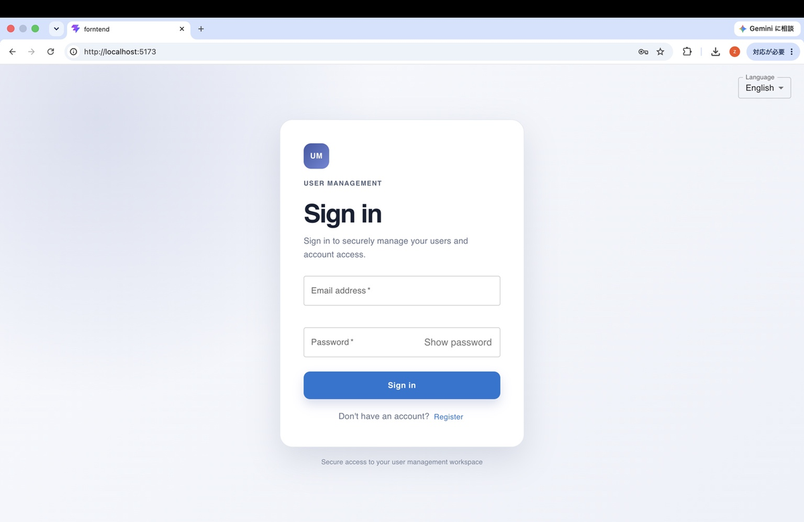
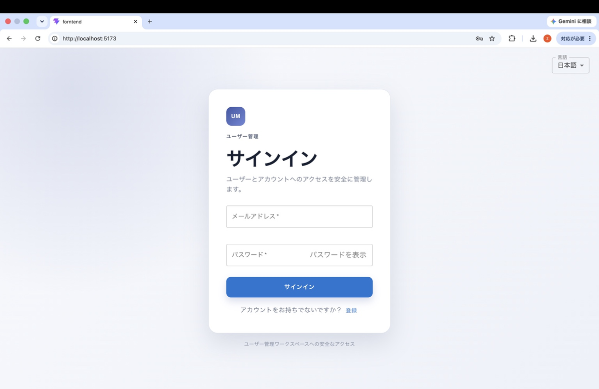
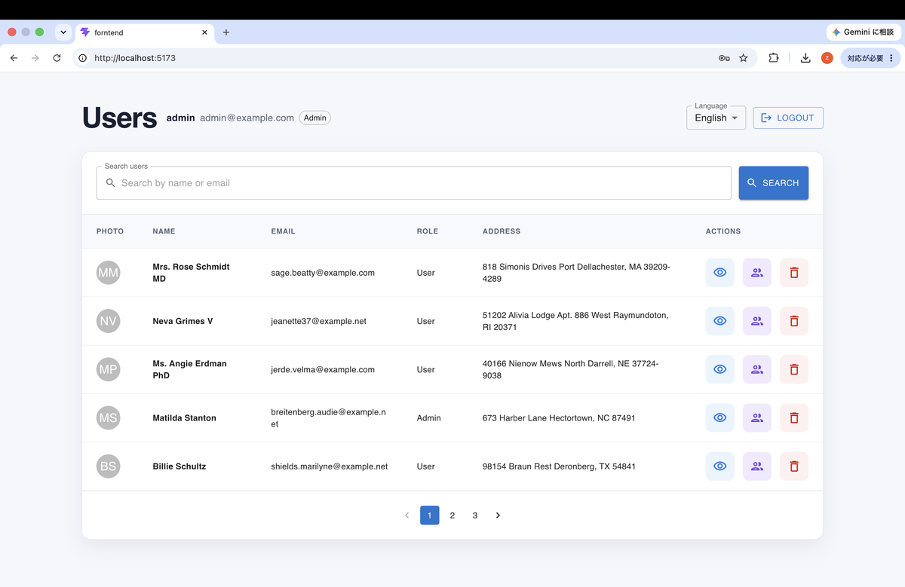
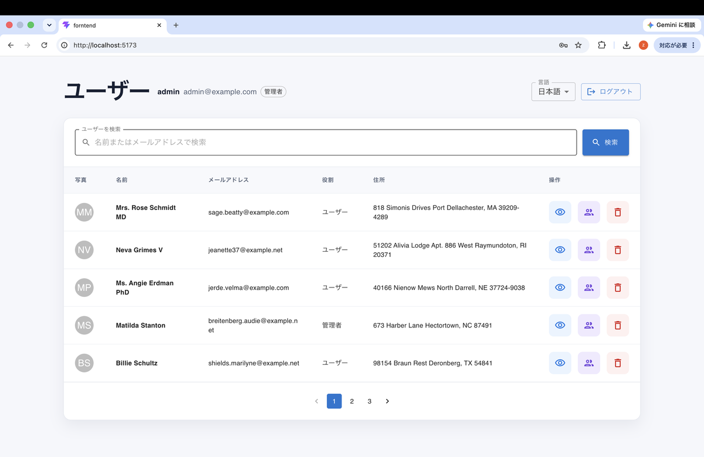

[English](README.md) | [日本語](README_JA.md)

# User Management System

A full-stack user management application built as a portfolio project. The React frontend communicates with a Laravel REST API for authentication, user profiles, role management, profile photos, search, and pagination.

## Project Overview

The application provides a responsive management workspace for authenticated users. Users can register, sign in, view the user list, open permitted profiles, edit their own profile, and change their password. Administrators can manage other users and their roles through policy-protected API actions.

The repository is split into two applications:

- `frontend/`: React + Vite + Material UI client
- `backend/`: Laravel JSON API and persistence layer

## Demo / Screenshots

The current UI is available in both English and Japanese. See [`docs/images/README.md`](docs/images/README.md) for the image inventory.

| Screen | English | Japanese |
| --- | --- | --- |
| Login |  |  |
| User list |  |  |

## Demo Accounts

| Role | Email | Password |
| --- | --- | --- |
| Admin | admin@example.com | password |
| User | user@example.com | password |

These accounts are provided for local development, testing, and demonstration purposes only.

## Main Features

- Sanctum bearer-token authentication
- Self-registration with address and optional profile photo
- Authenticated user list with name/email search and server-side pagination
- Profile viewing and editing with authorization checks
- Profile photo upload, replacement, and removal
- Password change with validation and token revocation
- Admin-only user creation, deletion, and role changes through the API
- English and Japanese UI support with persisted language selection
- Client-side and server-side validation with localized feedback

## Tech Stack

| Layer | Technologies |
| --- | --- |
| Frontend | React 19, Vite 8, Material UI 9, JavaScript |
| Backend | PHP 8.3+, Laravel 13, Laravel Sanctum 4 |
| Data | Eloquent ORM, SQLite by default; MySQL/MariaDB/PostgreSQL/SQL Server configuration is available |
| Assets | Laravel public filesystem disk for profile photos |
| Testing | PHPUnit 12 feature/unit tests; Oxlint is available for the frontend |

## System Architecture

```text
Browser
  └─ React/Vite UI
       └─ REST/JSON requests with Bearer token
            └─ Laravel API routes
                 ├─ Form Requests: input validation
                 ├─ Policies/Gates: authorization
                 ├─ Controllers + API Resource: application responses
                 ├─ Eloquent User model
                 └─ SQLite/MySQL/etc. + public profile-photo storage
```

The frontend reads `VITE_API_BASE_URL` and does not configure a Vite API proxy. The default local setup therefore runs Laravel on `http://127.0.0.1:8000` and points the frontend at that URL.

## Authentication

- `POST /api/register` creates a user and returns a Sanctum token.
- `POST /api/login` validates credentials and returns a Sanctum token.
- The frontend stores the token in `localStorage` and sends it as `Authorization: Bearer <token>`.
- `GET /api/me` returns the authenticated user.
- `POST /api/logout` revokes the current access token.
- `POST /api/change-password` changes the authenticated user's password and revokes all of that user's tokens.

## Authorization (Admin / User)

Authorization is implemented with `UserPolicy` and `Gate::authorize` calls on protected API actions.

| Capability | User | Admin |
| --- | ---: | ---: |
| View the paginated user list | Yes | Yes |
| View a detailed profile | Own profile | Any profile |
| Update a profile | Own profile | Any profile |
| Create a user through `POST /api/users` | No | Yes |
| Change a role | No | Yes |
| Delete a user | No | Yes |
| Change own password | Yes | Yes |

The user list is available to every authenticated user, while detailed profile access and mutations are policy-controlled.

## User Management

The user list displays profile photo, name, email, role, address, and action controls. The frontend supports profile viewing, administrator role changes, and deletion. Profile editing is available from the profile page; the backend also exposes an admin-only create endpoint.

## Registration

The registration form accepts name, email, password, password confirmation, address, and an optional photo. The API enforces unique email addresses, a minimum password length of eight characters, matching confirmation, accepted image formats, and a 2 MB photo limit. Client-supplied `role` is prohibited; new registrations receive the default `user` role.

Successful registration returns the new user and token, allowing the frontend to enter the authenticated workspace immediately.

## Search and Pagination

`GET /api/users` accepts:

- `search`: matches user name or email
- `page`: selects the result page

The backend paginates five users per page and returns paginator metadata. The frontend resets to page one for a new search and provides an empty state when no users match.

## User Profile

The profile page displays name, email, address, role, and avatar. A user can edit their own profile; administrators can view and edit other users. Password changes are exposed only on the signed-in user's own profile.

## Profile Photo

Profile photos are accepted during registration and profile updates as JPEG, PNG, or WebP files up to 2 MB. Files are stored under `profile-photos` on Laravel's `public` disk and returned as public URLs by `UserResource`. Updates replace the previous file, and removal deletes the stored file. The controller also cleans up newly uploaded files when a database update fails.

## Change Password

The change-password flow requires the current password, a new password of at least eight characters, and matching confirmation. Reusing the current password is rejected. After a successful change, all personal access tokens are deleted, so the frontend returns the user to the sign-in screen.

## Role Management

Roles are limited to `admin` and `user`. Only administrators can call `PATCH /api/users/{user}/role`; profile updates and public registration cannot change a role. The frontend provides a role-selection dialog for administrators.

## English / Japanese UI Support

The React client supports English (`en`) and Japanese (`ja`). English is the default language. The language switcher is available on the authentication, user-list, and profile screens, and the selected language is persisted in `localStorage`. Common validation, authorization, network, and API error messages are translated through the shared i18n context.

## Validation and Error Handling

- React forms validate required fields, email format, password length, password confirmation, and photo type/size before submission.
- Laravel Form Requests validate registration, profile updates, user creation, and password changes on the server.
- Sensitive fields such as `role`, `password`, and `user_id` are explicitly prohibited in the relevant requests.
- The frontend normalizes network failures, invalid responses, and HTTP errors into `UsersApiError` values and presents retry, empty, unauthorized, and validation states.
- API responses use JSON-friendly status codes including `201`, `401`, `403`, `404`, and `422` for the implemented flows.

## Security

- Laravel Sanctum protects authenticated API routes.
- Passwords are hashed and hidden from serialized user data.
- Unique email validation and request validation protect user input.
- Policy checks prevent unauthorized profile edits, role changes, and deletions.
- Registration cannot self-assign an administrator role.
- Profile file writes are validated, stored on the configured disk, and cleaned up on replacement/removal failures.

The current frontend intentionally persists the bearer token in `localStorage`, matching the implementation in `App.jsx` and the API services. Production deployments should use HTTPS and add an appropriate XSS/CSP review before treating this as a production authentication design.

## Main API Endpoints

All endpoints below `/api` are protected by `auth:sanctum` unless marked Public.

| Method | Endpoint | Access | Purpose |
| --- | --- | --- | --- |
| `POST` | `/api/register` | Public | Register and return a token |
| `POST` | `/api/login` | Public | Authenticate and return a token |
| `GET` | `/api/me` | Authenticated | Return the current user |
| `POST` | `/api/logout` | Authenticated | Revoke the current token |
| `POST` | `/api/change-password` | Authenticated | Change password and revoke all tokens |
| `GET` | `/api/users` | Authenticated | List, search, and paginate users |
| `POST` | `/api/users` | Admin | Create a user |
| `GET` | `/api/users/{user}` | Own user/Admin | Return a profile |
| `PUT/PATCH` | `/api/users/{user}` | Own user/Admin | Update profile fields and photo |
| `DELETE` | `/api/users/{user}` | Admin | Delete a user |
| `PATCH` | `/api/users/{user}/role` | Admin | Change `admin`/`user` role |

## Testing

Backend verification currently passes:

```text
php artisan test --compact
53 tests, 159 assertions
```

Coverage is concentrated in `backend/tests/Feature/AuthApiTest.php` and `backend/tests/Feature/UserApiTest.php`, including authentication, validation, authorization, search, pagination, profile photos, role changes, deletion, and password token revocation. The frontend package exposes `npm run lint` and `npm run build`, but no frontend automated test script is currently defined.

## Directory Structure

```text
.
├── backend/
│   ├── app/
│   │   ├── Http/Controllers/Api/
│   │   ├── Http/Requests/
│   │   ├── Http/Resources/
│   │   ├── Middleware/
│   │   ├── Models/
│   │   └── Policies/
│   ├── database/migrations/ factories/ seeders/
│   ├── routes/api.php
│   └── tests/Feature/ tests/Unit/
├── frontend/
│   └── src/
│       ├── components/
│       ├── i18n/
│       ├── pages/
│       └── services/
└── docs/images/
```

## Local Setup

### Backend

Requirements: PHP 8.3+, Composer, and a database supported by the Laravel configuration. SQLite is the default local database.

```bash
cd backend
composer install
cp .env.example .env
touch database/database.sqlite
php artisan key:generate
php artisan migrate --seed
php artisan storage:link
php artisan serve --host=127.0.0.1 --port=8000
```

The database seeder creates sample users, including an administrator and a regular user, for local development only. Do not use seeded credentials in a production environment.

### Frontend

In another terminal:

```bash
cd frontend
npm install
```

Create `frontend/.env` with the backend URL:

```dotenv
VITE_API_BASE_URL=http://127.0.0.1:8000
```

Start the Vite development server:

```bash
npm run dev
```

For a production bundle, use `npm run build`. The frontend build output is generated in `frontend/dist/` and is not the Laravel API deployment artifact.

## Design / Implementation Highlights

- Clear separation between the React client and Laravel API makes the authentication and authorization boundaries explicit.
- Form Requests keep validation rules close to each write operation, while API Resources define the public user shape and photo URL conversion.
- Policy checks are applied at the controller action level for profile visibility and mutations instead of relying only on UI state.
- Profile photo replacement is transaction-aware and removes stale or partially written files.
- The frontend normalizes API responses and error states, including stale sessions and empty search results, instead of assuming every response is successful.
- The shared language context keeps UI labels and common error messages consistent across the authentication, list, and profile screens.

## Future Improvements

The following are not currently implemented and would be natural next steps:

- Add frontend unit/component tests and an end-to-end browser test flow.
- Add email verification, password reset, and account recovery flows.
- Move production authentication toward an HttpOnly-cookie strategy or document a hardened token-storage policy.
- Add audit logging, rate limiting, and more granular permissions for production administration.
- Add a CI pipeline that runs backend tests, frontend linting, and frontend production builds.
